# Simulation

## Introduction

### Buffon's Needle

### Galileo's Dice

[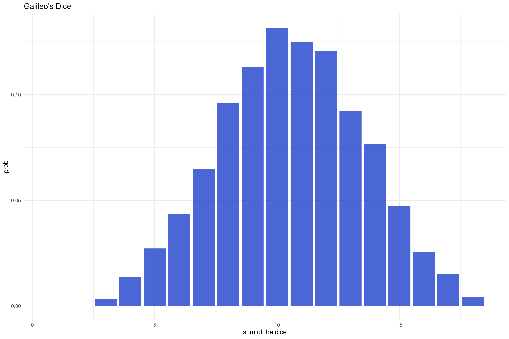](exercises/01-Galileo's-dice.R)

## Pseudorandom number generation

### Linear Congruential Generator (LCG)

[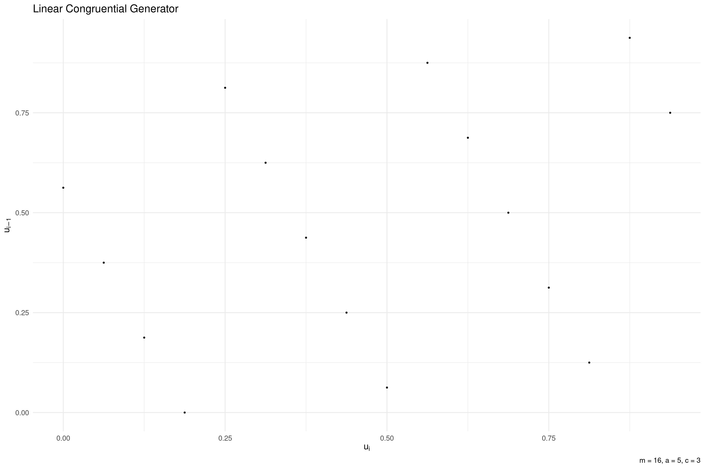](exercises/02-lgc.R)

### RANDU

[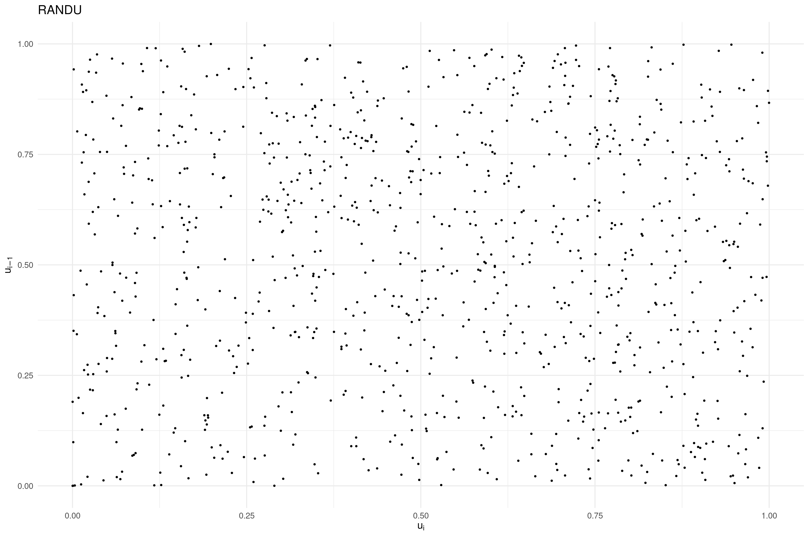](exercises/03-RANDU.R)

## General methods for generating random variables

### Inverse Transform Sampling

[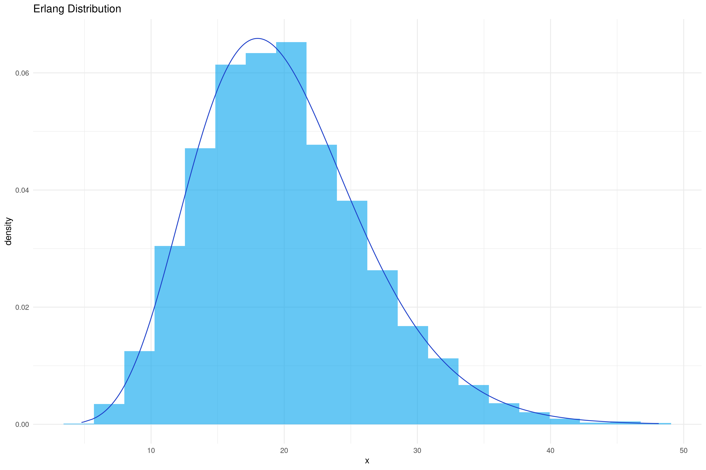](exercises/04-inverse-transform-sampling.R)

[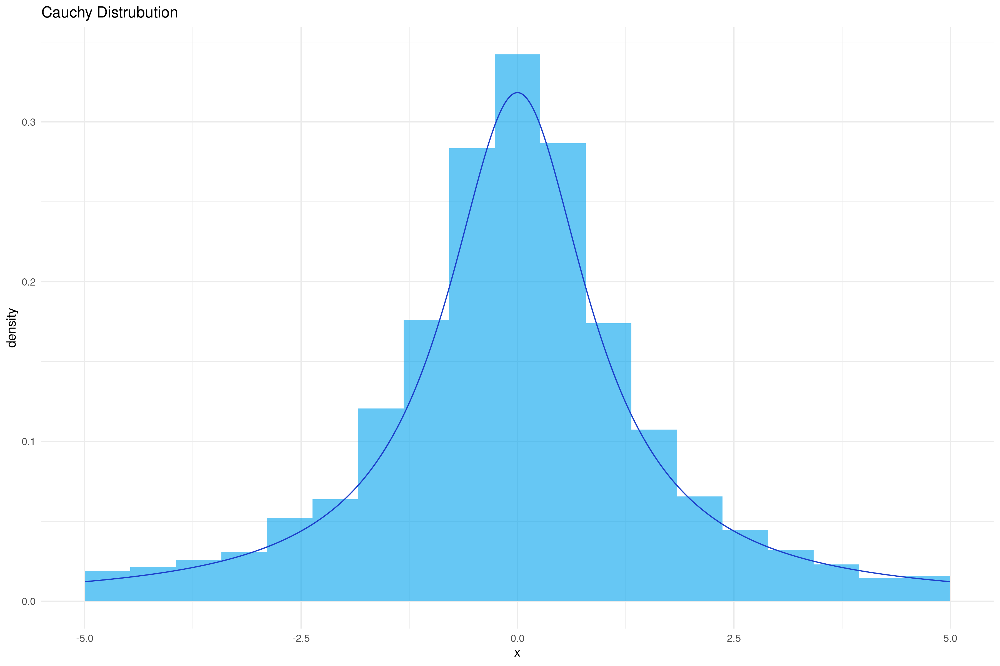](exercises/04-inverse-transform-sampling.R)

[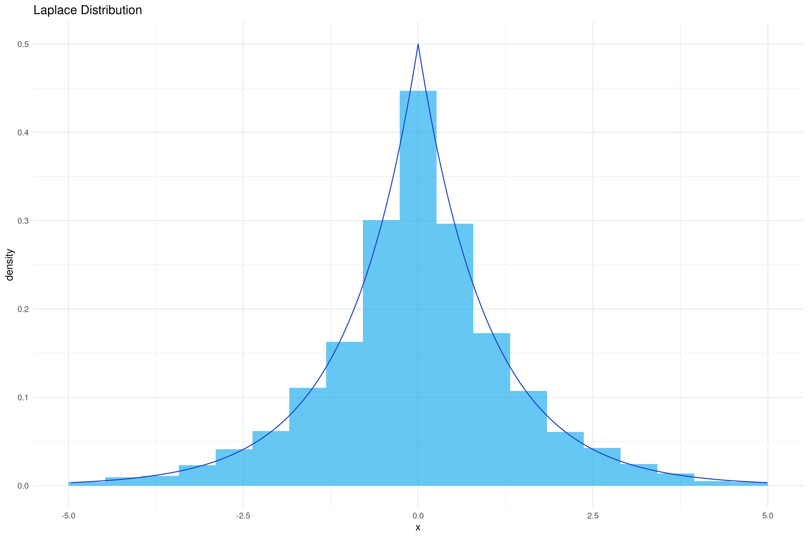](exercises/04-inverse-transform-sampling.R)

### Mixture Distribution

### Rejection Sampling

[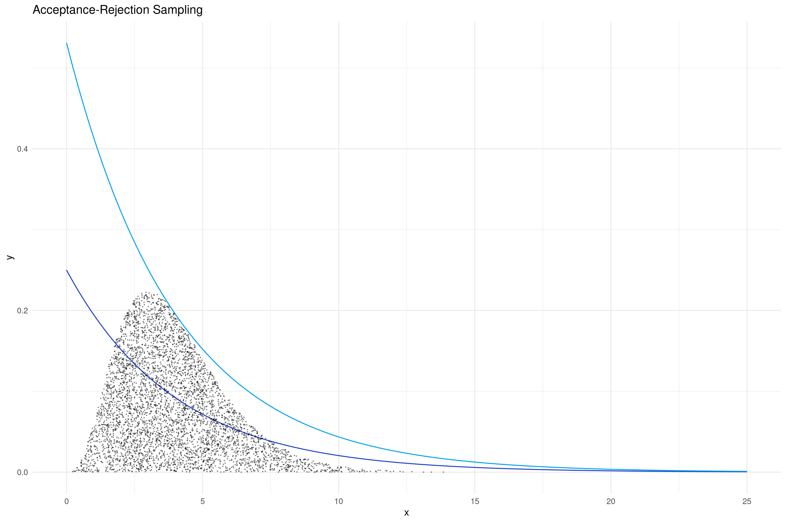](exercises/05-acceptance-rejection-sampling.R)

## Particular methods for generating random variables

### Central Limit Theorem

[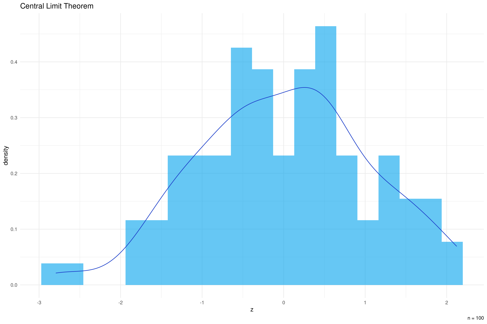](exercises/06-CLT.R)

[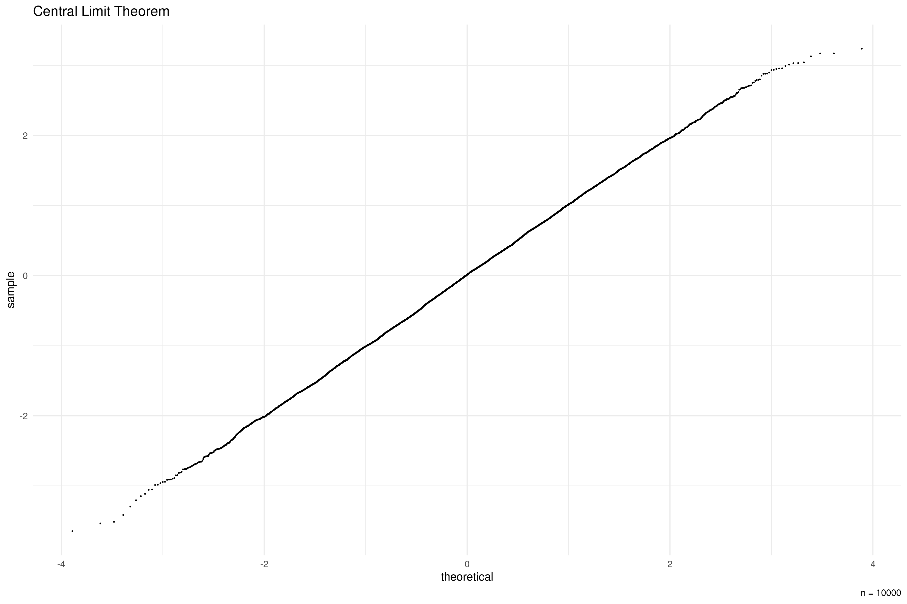](exercises/06-CLT.R)

[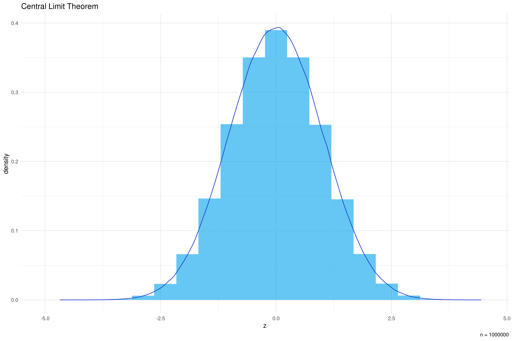](exercises/06-CLT.R)

### Box–Muller Transform

[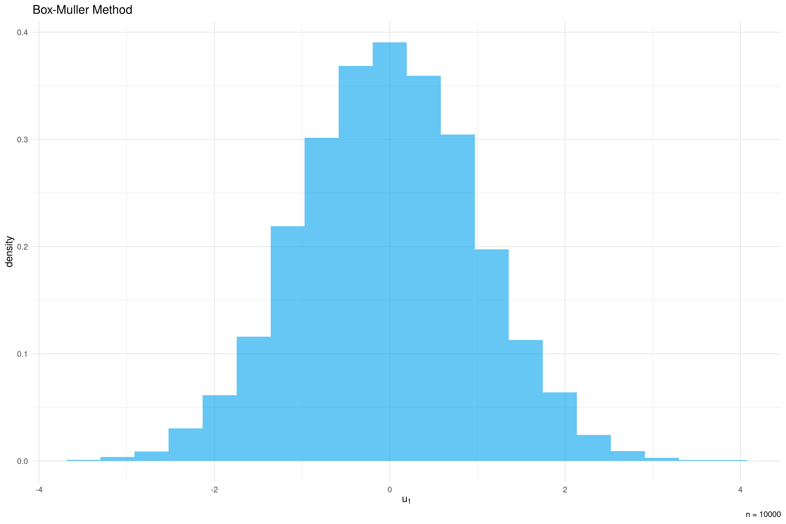](exercises/07-Box-Muller-method.R)

