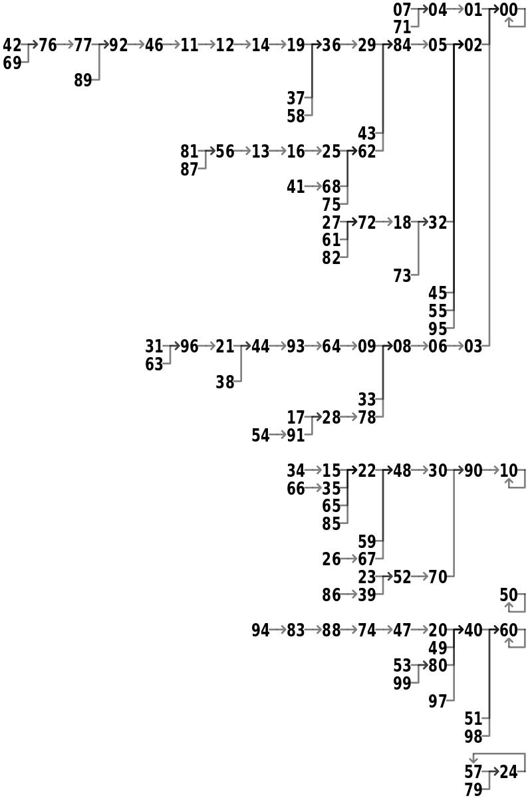
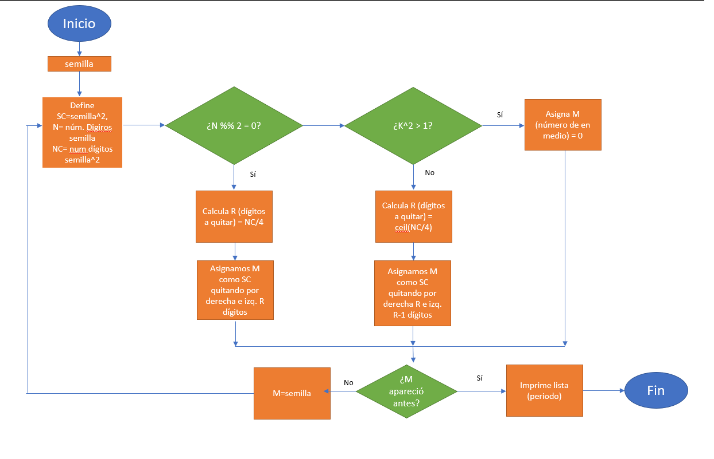

```{r setup, include=FALSE}
library(tufte)
library(tidyverse)
library(berryFunctions)
library(kableExtra)
library(stringi)

knitr::opts_chunk$set(
  cache.extra = packageVersion('tufte'),
  cache = TRUE,
  fig.height = 8,
  fig.pos = '!h',
  fig.width = 8,
  message=FALSE,
  out.extra = '',
  out.width='75%',
  warning=FALSE
)

options(htmltools.dir.version = FALSE)
```

# Problema 1

Con el fin de comprobar la propiedad de falta de memoria de una distribución exponencial

```{marginfigure}
$$ P(X > t + s \mid X > t) = P(X > s) . $$
```

$$F(x;\lambda) = 
\begin{cases}
1-e^{-\lambda x} & x \ge 0, \\
0 & x < 0.
\end{cases}$$

definimos la  siguiente función:

```{r}
exponential_memoryless <- function(N, lambda) {
    t <- sample(1:10, N, replace = TRUE) # t
    s <- sample(1:10, N, replace = TRUE) # s
    
    # P(X > t + s | X > t)
    prob.1 <- (1 - pexp(t + s, lambda)) / (1 - pexp(t, lambda))
    
    # P(X > s)
    prob.2 <- 1 - pexp(s, lambda)
    
    return(tibble(prob.1, prob.2, almost.equal(prob.1, prob.2)))
}
```

que produce dos vectores aleatorios $t$ y $s$ de tamaño $N$ para calcular $P(X > t + s \mid X > t)$ y $P(X > s)$. Finalmente, devuelve una matriz con las probabilidades calculadas y corrobora que se cumpla la igualdad en cada una de las $N$ simulaciones con una columna lógica `TRUE` o `FALSE`.

Ahora bien, simulamos 100 y 1,000,000 de eventos, imprimiendo una matriz con probabilidades en las que no se cumple la igualdad.

```{r}
lambda <- 1 / 3 # Parámetro
r.1 <- exponential_memoryless(100, lambda) # 100 simulaciones
r.2 <- exponential_memoryless(1000000, lambda) # 1 000 000 simulaciones

r.1[r.1[, 3] == FALSE, ]
r.2[r.2[, 3] == FALSE, ]
```

Nótese que la igualdad se cumple en todos los casos, corroborando que:

\begin{align*}
P(X > t + s \mid X > t) &= \frac{P\left(X > t + s, X > t \right)}{P(X > t)}\\
                        &= \frac{P(X > t + s)}{P(X > t)}\\
                        &= \frac{1 - F_X(t + s)}{1 - F_X(t)}\\
                        &= \frac{e^{-\lambda (t + s)}}{e^{-\lambda t}}\\
                        &= e^{-\lambda s}\\
                        &= P(X > s) .
\end{align*}

\newpage

# Problema 2 

```{r}
lanzamientos <- rbinom(500, 1, 0.5)
lanzamientos[lanzamientos == 0] <- 'A'
lanzamientos[lanzamientos == 1] <- 'S'
y <- c()
cont <- 0
for (i in 1:500) {
  if (lanzamientos[i] == 'S') {
    cont = cont + 1
    y[i] = cont
  } else{
    y[i] = cont
  }
}
```

## Inciso (i) 

```{r}
x <- c(1:500)
y1 <- y / x
```

```{r,fig.width = 10, fig.height = 3, fig.fullwidth = TRUE, cache=TRUE, echo=FALSE}
plot(
  x,
  y1,
  xlab = 'n',
  ylab = 'r/n',
  main = 'Número de soles/n por cada n lanzamientos',
  type = 'l',
  ylim = c(0, 0.9)
)
```

## Inciso (ii)

```{r}
y2 <- 2 * y - x
```

```{r,fig.width = 10, fig.height = 3, fig.fullwidth = TRUE, cache=TRUE, echo=FALSE}
plot(
  x,
  y2,
  xlab = 'n',
  ylab = '2r-n',
  main = 'Diferencia entre soles y águilas por cada n lanzamientos',
  type = 'l'
)
```

Podemos observar que la razón r/n se aproxima a 0.5 cuando el número de lanzamientos tiende a infinito; comportamiento que tiene sentido ya que al haber una probabilidad de 1/2 de obtener un águila o un sol, sabemos que aproximadamente en la mitad de nuestros lanzamientos tiraremos un sol.

En el segundo gráfico, podemos ver que la diferencia entre el número de águilas y soles obtenidos se centra alrededor del 0: es decir, conforme vamos aumentando el número de lanzamientos, tenemos aproximadamente la misma cantidad de soles y de águilas.  

\newpage

# Problema 3 

Los supuestos iniciales que consideramos para modelar la situación de las personas que llegaron a la isla fueron los siguientes:

  1. Las personas llegan a la isla con 20 años de edad. 
  2. No hay cambios de pareja a lo largo del tiempo. 
  3. Todas las personas recién llegadas se emparejan (es decir, hay 3 parejas).
  4. Cada pareja puede tener 1 bebé al año con probabilidad 0.6. La probabilidad de que el bebé sea hombre es de 0.4 y de que sea mujer 0.6. 
  5. La probabilidad de que el bebé sobreviva es de 0.7 
  6. Las parejas pueden tener, a lo más, 2 bebés. 

```{r}
n <- 6 #población total inicial
t <- c(1:10) #años transcurridos
sexo <- c('M', 'M', 'M', 'H', 'H', 'H')
edad <- c(20, 20, 20, 20, 20, 20)
pareja <- c('S', 'S', 'S', 'S', 'S', 'S')
num_hijos <- c(0, 0, 0, NaN, NaN, NaN)
tabla <- data.frame(sexo, edad, pareja, num_hijos)
cols <- c('sexo', 'edad', 'pareja', 'num_hijos')
tabla_nuevos <- data.frame()

for (tiempo in t) {
  for (persona in 1:6) {
    semilla_embarazo <- rbinom(1, 1, 0.6)
    semilla_sexo <- rbinom(1, 1, 0.6)
    semilla_muerte <- rbinom(1, 1, 0.3)
    if (tabla[persona, 3] == 'S' &&
        tabla[persona, 1] == 'M' && tabla[persona, 4] < 2) {
      if (semilla_embarazo == 1) {
        if (semilla_sexo == 1) {
          dato_nuevo <- c('M', 0, 'N', 0)
          n <- n + 1
        }
        else{
          dato_nuevo <- c('H', 0, 'N', NaN)
          
          n <- n + 1
        }
        if (semilla_muerte == 1) {
          dato_nuevo <- NaN
          n <- n - 1
        }
        else{
          tabla[persona, 4] = tabla[persona, 4] + 1
          tabla_nuevos <- rbind(tabla_nuevos, dato_nuevo)
        }
      }
    }
  }
  if (n > 11) {
    #print(tiempo)
    colnames(tabla_nuevos) <- c('sexo', 'edad', 'pareja', 'num_hijos')
    break
  }
}
```

En las siguientes tablas (tabla de población original y tabla de bebés recié nacidos), podemos observar el comportamiento de la población tomando en cuenta los supuestos previamente mencionados. Al ejecutar el código anterior un total de 10 veces, obtuvimos que el tiempo (t) en que la población de duplica es de 3,6,7,3,8,4,5,5,7 y 4 años, promediando un total de 5.2 años. 

```{r,echo=FALSE}
print(tabla)
print(tabla_nuevos)
```

Otros supuestos que se pueden tomar, a largo plazo, que nos parecieron adecuados para un problema de este estilo son:

* A qué edad los bebés pueden emparejarse y comenzar a reproducirse.
* Cambios de parejas entre las personas. 
* Número límite de bebés.
* Edad a la que las mujeres dejan de tener bebés. 

\newpage

# Problema 4

Simulamos la posible llegada de un cliente $Y \sim \text{Bernoulli}(0.9)$ tal que dicho cliente llega $(X \mid Y = 1) = 5 + u_1$, donde $u_1 \sim P(\text{llegada})$. Finalmente, para determinar el tiempo de salida $u_3$, necesitamos $u_2 \sim P(\text{tiempo de consulta})$ tal que $u_3 = u_1 + u_2$.

Así pues, para 50 pacientes:

```{r}
N <- 50 # número de pacientes
arrival <- duration <- numeric(N)

arrived <- rbinom(N, 1, 0.9) # qué pacientes llegaron
k <- length(which(arrived == 1)) # cuántos pacientes llegaron

arrival[which(arrived == 1)] <-
    5 + sample(-2:2,
               k,
               prob = c(0.1, 0.2, 0.4, 0.2, 0.1),
               replace = TRUE)
duration[which(arrived == 1)] <-
    sample(2:9,
           k,
           prob = c(0.1, 0.1, 0.1, 0.2, 0.2, 0.1, 0.1, 0.1),
           replace = TRUE)

arrival.time <- cumsum(arrival)

departure <- arrival.time + duration

# Clientes en espera cada 5 horas
queue <- as.data.frame(table(cut(departure, breaks = seq(0, N * 5, by = 5))))
```

```{r fig.width = 10, fig.height = 3, fig.fullwidth = TRUE, cache=TRUE, echo=FALSE}
ggplot(queue, aes(x = Var1, y = Freq, group = 1)) +
    geom_point() +
    geom_line() +
    labs(title = 'Clientes en espera cada 5 horas',
         x = '',
         y = 'Clientes') +
    theme_minimal() +
    theme(panel.grid.major = element_blank(),
          panel.grid.minor = element_blank(),
          axis.text.x=element_blank())
```

\newpage 

# Problema 5

Probar que la parte fraccionaria de la suma de uniforemes $[0,1]$ $U_1 + \cdots + U_k$ es también uniforme en el intervalo [0,1]. (\textit{hint:} usar inducción matemática)

\vspace{3mm}

\textit{\textbf{Demostración:}}

\vspace{3mm}

Denotemos con $\{U\} := U - [U]$ la función fraccional.

\vspace{3mm}

Base de inducción: por demostrar $\{U_1 + U_2\} \thicksim \mathcal{U}[0,1]$

\vspace{3mm}

Se trata de una transformación de variables aleatoria por tanto definamos las siguientes variables aleatorias. 

\vspace{3mm}


\begin{align*}
    U_1 = Z -U_2 \\
    U_2=W
\end{align*}

\vspace{3mm}

Obtenemos el Jacobiano de nuestro sistema de variables aleatorias para obtener la función de distribución conjunta de la transformación.

\vspace{3mm}

$$J(z,w) = \begin{vmatrix}
1 & -1 \\ 
0 & 1  \notag
\end{vmatrix} = 1$$

\vspace{3mm}

Por ende, 

$$K(z,w)= \mathbb{I}\{0 \leq z - w \leq 1 \}(z) \mathbb{I}\{0 \leq w \leq 1 \}(w) \Rightarrow$$

$$K(z,w)= \mathbb{I}\{w \leq z  \leq 1 + w \}(z) \mathbb{I}\{0 \leq w \leq 1 \}(w)  $$

\vspace{3mm}

Para obtener $f_{{U_1 + U_2}}(u)$ obtenemos la distribución marginal $K_Z(z)$

\vspace{3mm}

$$f_{\{U_1 + U_2\}}(u) = K_Z(z) = \int_{\mathcal{R}}K(z,w)dw =
\begin{cases} 
\int \mathbb{I}\{w \leq z  \leq 1 \}(z) \mathbb{I}\{0 \leq w \leq z \}(w) dw \\
\int \mathbb{I}\{w \leq z  \leq 2 \}(z) \mathbb{I}\{z-1 \leq w \leq 1 \}(w) dw
\end{cases}
$$

\vspace{3mm}

Son dos casos para la integral pues la región de integración no es simple. 

$$K_Z(z)=\begin{cases} 
\int_0^z \mathbb{I}\{w \leq z  \leq 1 \}(z) dw \\
\int_{z-1}^1 \mathbb{I}\{w \leq z  \leq 2 \}(z) dw 
\end{cases} = \begin{cases}
z & , 0\leq z \leq 1 \\
2-z & , 1 \leq z \leq 2
\end{cases} $$

Así pues, 

\vspace{3mm}

\begin{equation*}
    \begin{aligned}
        F_{\{U_1+U_2\}}(u)= \mathbb{P}[\{U_1 + U_2\} \leq u] &= \int_{0}^u f_{\{1+2\}}(v)dv + \int_{1}^{1+v} f_{\{1+2\}}(v)dv \\
        &= \frac{v^2}{2}\Bigg]^u_{0} + 2v\Bigg]^{1+u}_1-\frac{v^2}{2}\Bigg]^{1+u}_{1}=u
    \end{aligned}
\end{equation*}

\vspace{3mm}

Por tanto, $\{U_1 + U_2\} \sim \mathcal{U}[0,1]$.

\vspace{3mm}

Hipótesis de inducción: Supongamos que $\{U_1 + \cdots + U_n\}\sim \mathcal{U}[0,1]$. Por demostrar que $\{U_1 + \cdots + U_{n+1}\}\sim \mathcal{U}[0,1]$.

\vspace{3mm}

$$\{U_1 + \cdots + U_{n+1} \} = \{\underbrace{\{U_1 + \cdots + U_n\}}_{\text{se distribuye $\mathcal{U}[0,1]$ por H.I.} }+ \,\, U_{n+1}\} \sim \mathcal{U}[0,1] \,\, (\text{paso inductivo cuando } n=2) \,\,\,\,\, \blacksquare$$


\newpage

# Problema 6

Mostremos la función de cuadrado medio que calcula Zn a partir de Zn-1 y que imprime la lista del periodo de la semilla. 

```{r}
cuadradoMedio <- function(semilla) {
  condicion = 0
  
  #definimos vector donde irá lista de periodo de generación de numeros
  cMLista <- NULL
  
  #condicion de paro
  while (condicion == 0) {
    #checamos si la semilla tiene número de carácteres pares o impares
    semilla2 <- semilla ^ 2
    semilla2 <- as.character(semilla2)
    
    if (nchar(semilla) %% 2 == 0) {
      #si semilla tiene #car par
      numDigRmv <- nchar(semilla2) / 4
      medio <- substr(semilla2, numDigRmv + 1, nchar(semilla2) - numDigRmv)
      medioNum <- as.numeric(medio)
    }
    
    #si la semilla es impar
    if (nchar(semilla) %% 2 != 0) {
      if (nchar(semilla2) == 1) {
        medio = 0
        medioNum <- as.numeric(medio)
      }
      if (nchar(semilla2) > 1) {
        #llenamos con ceros hasta que sea el doble del tamaño de digitos de la semilla
        semilla2 <- stri_pad_left(semilla2, 2 * nchar(semilla), 0)
        numDigRmv <- ceiling(nchar(semilla2) / 4)
        medio <- substr(semilla2, numDigRmv, nchar(semilla2) - numDigRmv)
        medioNum <- as.numeric(medio)
      }
    }
    
    if (medio %in% cMLista == TRUE) {
      condicion = 1
    }
    
    if (medio %in% cMLista == FALSE) {
      cMLista <- rbind(cMLista, medio)
      
      semilla <- medioNum
    }
  }
  return(t(cMLista))
}
```

Lista de ciclos cuando la semilla pertence al conjunto {1,...,99}

```{r out.width='60%', fig.fullwidth = TRUE, echo=FALSE}

```

\newpage

El método del cuadrado medio es de baja calidad para la generación de números aleatorios ya que puede degenerar fácilmente en cero resultando en una lista de números aleatorios corta. Además, este método no pasa pruebas estándares de independecia y aleatoriedad por lo que no se recomienda su uso más que para fines didácticos. 

Diagrama de flujo de algorítmo de cuadrado medio:

```{r out.width='100%', fig.fullwidth = TRUE, echo=FALSE}

```

\newpage

# Problema 7

Si dos dados están cargados de tal manera que en un dado, el valor 1 aparecerá exactamente el doble de veces que los otros valores, y el otro dato está igualmente cargado hacia el 6, calculen la probabilidad $p_{s}$ de que un total exactamente igual a $s$ aparecerá en la suma de los dados, para $2\leq s \leq 12$.

Sea $D_{1}$ el dado cargado al valor 1 y $D_{6}$ el dado cargado al valor 6. En cada dado $D_{i}$, la probabilidad de obtener el valor $i$ es el doble de la probabilidad de obtener cualquier otro valor. Sea $q$ la probabilidad de obtener el valor $i$ en el dado $D_{i}$, y $q/2$ la probabilidad de obtener cualquier otro valor, por lo que: 

$$\sum_{k=1}^{6}P[D_{i} = k] =  q + \frac{q}{2} + \frac{q}{2} + \frac{q}{2} + \frac{q}{2} + \frac{q}{2} = 1 \implies \frac{7q}{2} = 1 \implies q = \frac{2}{7}$$

Entonces $P[D_{i} = i] = \frac{2}{7}$ y $P[D_{i} = j] = \frac{1}{7}$, para $i\neq j$.

Sea $s$ la suma del valor de los dados $D_{1}$ y $D_{6}$. Suponiendo que $D_{1}$ y $D_{6}$ son independientes, entonces:

\begin{align*}
P[s = 2]  &= P[D_{1} = 1, D_{6} = 1] \\
          &= \frac{2}{7}\cdot\frac{1}{7} \\
          &= \frac{2}{49} \\
P[s = 3]  &= P[D_{1} = 1, D_{6} = 2] + P[D_{1} = 2, D_{6} = 1] \\
          &= \frac{2}{7}\cdot\frac{1}{7} + \frac{1}{7}\cdot\frac{1}{7} \\
          &= \frac{3}{49} \\
P[s = 4]  &= P[D_{1} = 1, D_{6} = 3] + P[D_{1} = 2, D_{6} = 2] \\ 
          &+ P[D_{1} = 3, D_{6} = 1] \\
          &= \frac{2}{7}\cdot\frac{1}{7} + \frac{1}{7}\cdot\frac{1}{7} + \frac{1}{7}\cdot\frac{1}{7} \\
          &= \frac{4}{49} \\
P[s = 5]  &= P[D_{1} = 1, D_{6} = 4] + P[D_{1} = 2, D_{6} = 3] \\ 
          &+ P[D_{1} = 3, D_{6} = 2] + P[D_{1} = 4, D_{6} = 1] \\
          &= \frac{2}{7}\cdot\frac{1}{7} + \frac{1}{7}\cdot\frac{1}{7} + \frac{1}{7}\cdot\frac{1}{7} + \frac{1}{7}\cdot\frac{1}{7} \\
          &= \frac{5}{49}
\end{align*}

\newpage

\begin{align*}
P[s = 6]  &= P[D_{1} = 1, D_{6} = 5] + P[D_{1} = 2, D_{6} = 4] \\ 
          &+ P[D_{1} = 3, D_{6} = 3] + P[D_{1} = 4, D_{6} = 2] \\ 
          &+ P[D_{1} = 5, D_{6} = 1] \\
          &= \frac{2}{7}\cdot\frac{1}{7} + \frac{1}{7}\cdot\frac{1}{7} + \frac{1}{7}\cdot\frac{1}{7} + \frac{1}{7}\cdot\frac{1}{7} + \frac{1}{7}\cdot\frac{1}{7} \\
          &= \frac{6}{49} \\
P[s = 7]  &= P[D_{1} = 1, D_{6} = 6] + P[D_{1} = 2, D_{6} = 5] \\
          &+ P[D_{1} = 3, D_{6} = 4] + P[D_{1} = 4, D_{6} = 3] \\ 
          &+ P[D_{1} = 5, D_{6} = 2] + P[D_{1} = 6, D_{6} = 1] \\
          &= \frac{2}{7}\cdot\frac{2}{7} + \frac{1}{7}\cdot\frac{1}{7} + \frac{1}{7}\cdot\frac{1}{7} + \frac{1}{7}\cdot\frac{1}{7} + \frac{1}{7}\cdot\frac{1}{7} + \frac{1}{7}\cdot\frac{1}{7} \\
          &= \frac{9}{49} \\
P[s = 8]  &= P[D_{1} = 2, D_{6} = 6] + P[D_{1} = 3, D_{6} = 5] \\ 
          &+ P[D_{1} = 4, D_{6} = 4] + P[D_{1} = 5, D_{6} = 3] \\ 
          &+ P[D_{1} = 6, D_{6} = 2] \\
          &=  \frac{1}{7}\cdot\frac{2}{7} + \frac{1}{7}\cdot\frac{1}{7} + \frac{1}{7}\cdot\frac{1}{7} + \frac{1}{7}\cdot\frac{1}{7} + \frac{1}{7}\cdot\frac{1}{7} \\
          &= \frac{6}{49} \\
P[s = 9]  &= P[D_{1} = 3, D_{6} = 6] + P[D_{1} = 4, D_{6} = 5] \\ 
          &+ P[D_{1} = 5, D_{6} = 4] + P[D_{1} = 6, D_{6} = 3] \\
          &= \frac{1}{7}\cdot\frac{2}{7} + \frac{1}{7}\cdot\frac{1}{7} + \frac{1}{7}\cdot\frac{1}{7} + \frac{1}{7}\cdot\frac{1}{7} \\
          &= \frac{5}{49} \\
P[s = 10] &= P[D_{1} = 4, D_{6} = 6] + P[D_{1} = 5, D_{6} = 5] \\ 
          &+ P[D_{1} = 6, D_{6} = 4] \\
          &= \frac{1}{7}\cdot\frac{2}{7} + \frac{1}{7}\cdot\frac{1}{7} + \frac{1}{7}\cdot\frac{1}{7} \\
          &= \frac{4}{49} \\
P[s = 11] &= P[D_{1} = 5, D_{6} = 6] + P[D_{1} = 6, D_{6} = 5] \\
          &= \frac{1}{7}\cdot\frac{2}{7} + \frac{1}{7}\cdot\frac{1}{7} \\
          &= \frac{3}{49} \\
P[s = 12] &= P[D_{1} = 6, D_{6} = 6] \\
          &= \frac{1}{7}\cdot\frac{2}{7} \\
          &= \frac{2}{49}
\end{align*}

Entonces, las probabilidades para $2 \leq s \leq 12$:

```{r prob_sum_dices_table, echo = FALSE}
# Creamos vectores con cada valor de s y con las probabilidades de cada valor de s
s <- c(2:12)
p <-
  c('2/49',
    '3/49',
    '4/49',
    '5/49',
    '6/49',
    '9/49',
    '6/49',
    '5/49',
    '4/49',
    '3/49',
    '2/49')

# Creamos dataframe con las probabilidades de cada valor de s
probs <- data.frame(s, p)

# Trasponemos el dataframe
probs <- data.frame(t(probs))
rownames(probs) <- c('$s$', '$P$')

# Creamos tabla con las probabilidades
probs %>%
  kbl(
    align = 'c',
    booktabs = T,
    format = 'latex',
    escape = F,
    col.names = NULL
  ) %>%
  kable_styling(latex_options = 'striped')
```

\bibliography{}
