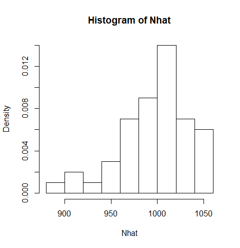
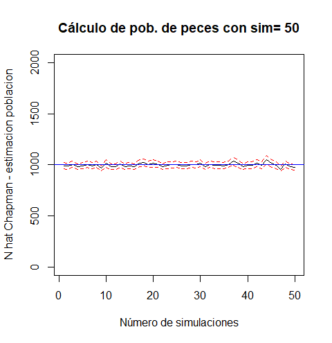
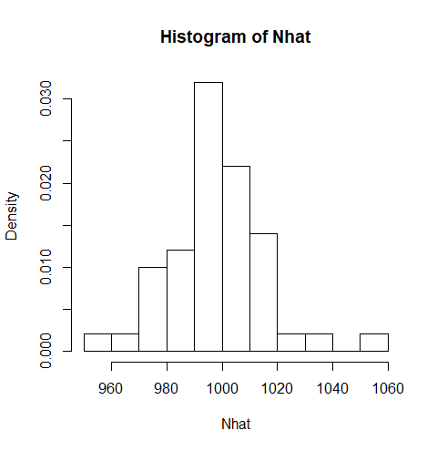
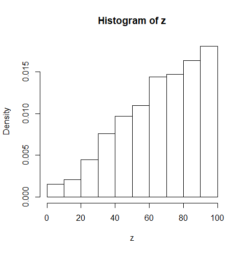

```{r setup, include=FALSE}
library(tufte)
library(tidyverse)
library(mvtnorm)
library(GGally)
library(tictoc)
library(EnvStats)

knitr::opts_chunk$set(
  cache.extra = packageVersion('tufte'),
  cache = TRUE,
  fig.height = 8,
  fig.pos = '!h',
  fig.width = 8,
  message = FALSE,
  out.extra = '',
  out.width = '75%',
  warning = FALSE
)

options(htmltools.dir.version = FALSE)
```

# Problema 1

\vspace{3mm}

Para este problema se impondrán los siguientes supuestos:

\begin{itemize}
\item La población es cerrada. Durante el tiempo de estudio asumimos que el tamaño poblacional $N$ permanece constante o, si se produce una variación en dicho tamaño, esta es insignificante respecto al verdadero tamaño poblacional.
\item Todos los individuos de la población tienen la misma probabilidad de ser capturados en la primera muestra.
\item La segunda muestra es también una muestra aleatoria. Para la validez de esta hipótesis, necesitamos que los métodos con los que se marquen a los individuos no afecten a la capturabilidad, de modo que en la recaptura, un individuo que no está marcado tenga la misma probabilidad de ser capturado que uno que no lo está.
\end{itemize}

\vspace{3mm}

Usaremos dos estimadores para el número total de la población de peces $N$. El primero corresponde al estimador conseguido por el método de Máxima Verosimilitud. El segundo corresponde al estimador propuesto por Chapman. El motivo del uso de los dos estimadores es que el estimador de MV puede indefinirse si en la segunda muestra aleatoria no se captura ningún pez marcado y que además no es insesgado ni asintóticamente insesgado así como su estimador de varianza.

\vspace{3mm}

Notemos que el problema puede modelarse con una distribución hipergeométrica, ya que tenemos a la población $N$ particionada en dos conjuntos: marcados y no marcados. Así pues, nuesta función de verosimilitud es la función masa de probabilidad de la distribución hipergeométrica con argumento $N$. Para obtener el estimador de máxima verosimilitud maximizamos discretamente nuestra función de verosimilitud. Denotemos con $\hat{N}$ el estimador MV y al coeficiente binomial con $binom(N, k)$

\[\hat{N} \text{ maximiza } \mathcal{L} \Longleftrightarrow \,\, \frac{\mathcal{L}(N)}{\mathcal{L}(N-1)} \geq 1  \Rightarrow \]

\[\frac{(N-n_1)(N-n_2)}{N(N-n_1-n_2+y)} > 1 \Rightarrow \]

\[N < \frac{n_1*n_2}{y} \Rightarrow \hat{N}= ceil\left(\frac{n_1*n_2}{y}\right).\]

\vspace{3mm}

Por otro lado, el estimador de Chapman, denotado con $\tilde{N}$ tiene la siguiente expresión,

\[\tilde{N}= ceil\left(\frac{(n_1 +1)(n_2+ 1)}{y+1} - 1.\right)\]

\vspace{3mm}

Por tanto con los datos del problema tenemos que la estimación puntual de $N$ es,

\[\hat{N}= ceil\left( \frac{250*174}{50}\right)=870 \]

\[\tilde{N}= ceil\left(\frac{(250 +1)(174+ 1)}{50+1} - 1 = 861.\right)\]

\vspace{3mm}

Ahora, para determinar el tamaño de $n_2$ y conseguir una buena aproximación de $N$ usaremos un nivel $\alpha = 0.05$ de significancia, la desigualdad de Chebyshev y como parámetros dados a $y$ y $n_1$. Para obtener el tamaño usaremos el estimador de Chapman y el estimador de la varianza de Chapman que tiene la siguiente expresión

\[\text{Desigualdad de Chebyshev: }\, \mathbb{P}\left(|\tilde{N} - \mu| \geq z_{1-\frac{\alpha}{2}} * \sqrt{var(\tilde{N})} \right) < \frac{var(\tilde{N})}{z_{1-\frac{\alpha}{2}} * \sqrt{var(\tilde{N})}}=0.95 \]

Donde,

\[var(\tilde{N})= \frac{(y +1)(n_2 +1)(n_1-y)(n_2-y)}{(y+1)^2(y +2)} .\]

\vspace{3mm}

A continuacion se presentará el código en \texttt{R} que calcula con una función la estimación de $N$ con simulación usando un intervalo de confianza al 95\% tanto con el estimador de máxima verosimilitud como con el de Chapman. Y también una función que calcula el tamaño de $n_2$ para el tamaño de población marcada $n_1$ y el número de población marcada que se obtuvo en el segundo muestreo $y$ dados.

```{r}
###### PROBLEMA UNO #######


# Esta primera función usa el estimador de la varianza de Sekar y Deming y
# el estimador de N que se obtiene del método de máxima verosimilitud.
# El problema del estimador de máxima verosimilitud y de la varianza es
# Esta primera función usa el estimador de la varianza de Sekar y Deming y
# el estimador de N que se obtiene del método de máxima verosimilitud.
# El problema de el estimador de maxima verosimilitud y de la varianza es
# que se indefine cuando el número de peces capturados marcados es cero.


captura_recaptura <- function(N, n1, S) {
  # N <- tamaño población de peces en el estanque
  # n1 <- peces marcados y devueltos de la primera muestra
  # n2 <- tamaño de la muestra después de regresar al estanque
  # S <- número de simulaciones

  # simulamos la muestra aleatoria del segundo muestreo
  n2 <- sample(0:N, 1)

  alfa <- 0.05 #nivel de significancia
  z <- qnorm(1 - alfa / 2) #cuantil normal

  # obtenemos una simulación de hipergeométrica para simular cuántos
  # peces marcados obtenemos de la segunda muestra
  y <- rhyper(S, n1, N - n1, n2)
  #usamos nuestro estimador de máxima verosimilitud
  Nhat <- ceiling((n1 * n2) / y) #vector de estimaciones
  # obtenemos una simulación de hipergeométrica para simular cuantos
  # peces marcados obtenemos de la segunda muestra
  y <- rhyper(S, n1, N - n1, n2)
  # usamos nuestro estimador de máxima verosimilitud
  Nhat <- ceiling((n1 * n2) / y) #vector de estimaciones

  # calculamos la varianza muestral de nuestro estimador
  varNhat <- (n1 * n2 * (n1 - y) * (n2 - y)) / y^2

  # calculamos los intervalos de confianza para nuestro estimador
  limInf <- Nhat - z * sqrt(varNhat)
  limSup <- Nhat + z * sqrt(varNhat)

  grafica <- plot(
    1:S,
    Nhat,
    type = 'l',
    ylim = c(-100, 3 * N),
    main = paste('Cálculo de pob. de peces con sim=', S),
    xlab = 'Número de simulaciones',
    ylab = 'N hat MV - estimacion poblacion'
  )

  lines(1:S, limInf, lty = 2, col = 'red')
  lines(1:S, limSup, lty = 2, col = 'red')
  abline(h = N, col = 'blue')

  h <- hist(Nhat, prob = T)

  return(grafica, h)
}
```

```{r out.width='60%', fig.fullwidth = TRUE, echo=FALSE}
knitr::include_graphics('captura_N_MV.png')
```

```{r out.width='60%', fig.fullwidth = TRUE, echo=FALSE}

```

```{r} 
# La siguiente funcion usa el estimador de N propuesto por Chapman en 1982.
# Este estimador no se indefine y es asintoticamente insesgado así como
# su estimacion de varianza también es asintoticamente insesgada.

#la siguiente función usa el estimador de N propuesto por Chapman en 1982.
# Este estimador no se indefine y es asintóticamente insesgado así como
# su estimador de la varianza también es asintóticamente insesgado.

captura_recaptura2 <- function(N, n1, S) {
  # N <- tamaño población de peces en el estanque
  # n1 <- peces marcados y devueltos de la primera muestra
  # n2 <- tamaño de la muestra después de regresar al estanque
  # S <- número de simulaciones
  
  # simulamos la muestra aleatoria del segundo muestreo
  n2 <- sample(0:N, 1)
  
  alfa <- 0.05 #nivel de significancia
  z <- qnorm(1 - alfa / 2) #cuantil normal
  
  # obtenemos una simulación de hipergeométrica para simular cuántos
  # peces marcados obtenemos de la segunda muestra
  y <- rhyper(S, n1, N - n1, n2)
  #usamos nuestro estimador de máxima verosimilitud
  Nhat <- ceiling(((n1 + 1) * (n2 + 1)) / (y + 1) - 1) #vector de estimaciones
  # obtenemos una simulación de hipergeométrica para simular cuantos
  # peces marcados obtenemos de la segunda muestra
  y <- rhyper(S, n1, N - n1, n2)
  # usamos nuestro estimador de máxima verosimilitud
  Nhat <-
    ceiling(((n1 + 1) * (n2 + 1)) / (y + 1) - 1) #vector de estimaciones
  
  # calculamos la varianza muestral de nuestro estimador
  varNhat <-
    ((y + 1) * (n2 + 1) * (n1 - y) * (n2 - y)) / ((y + 1) ^ 2 *
                                                    (y + 2))
  # calculamos los intervalos de confianza para nuestro estimador
  limInf <- Nhat - z * sqrt(varNhat)
  limSup <- Nhat + z * sqrt(varNhat)
  
  grafica <- plot(
    1:S,
    Nhat,
    type = 'l',
    ylim = c(0, 2 * N),
    main = paste('Cálculo de pob. de peces con sim=', S),
    xlab = 'Número de simulaciones',
    ylab = 'N hat Chapman - estimacion poblacion'
  )
  
  lines(1:S, limInf, lty = 2, col = 'red')
  lines(1:S, limSup, lty = 2, col = 'red')
  abline(h = N, col = 'blue')
  
  h <- hist(Nhat, prob = T)
  
  return(grafica, h)
}
```

\newpage

```{r out.width='60%', fig.fullwidth = TRUE, echo=FALSE}

```

```{r out.width='60%', fig.fullwidth = TRUE, echo=FALSE}

```

Notemos gráficamente como el estimador de Chapman nos proporciona mejores resultados para el intervalo de confianza y para la estimamción de $N$.

```{r}
# para calcular el tamanio de n2 para garantizar una buena aproximacion usaremos
# el estimador de Chapman. La siguiente función obtiene el tamaño de n2 usando
# la desigualdad de Chebyshev para calcular el tamanio de n2 para garantizar
# una buena aproximacion usaremos el estimador de Chapman.

tamanio_n2 <- function(N, n1, y) {
  # ¿de qué tamanio debe ser n2 (segunda muestra) para alcanzar
  # una buena aproximacion de N (poblacion)?
  # ¿de qué tamaño debe ser n2 (segunda muestra) para alcanzar
  # una buena aproximacion de N (población)?
  #Dada la población N, los peces marcados n1 y el número de peces marcados
  # obtenidos de la segunda muestra aleatoria (variable) y
  # respondemos a la pregunta formulada arriba.

  # Para caluclar el tamaño de n2, usaremos la desigualdad de Chebyshev
  # para alcanzar una buena aproximación a N
  # tomando un nivel de significancia de alfa =0.05
  # Dada la población N, los peces marcados n1 y el número de peces marcados
  # obtenidos de la segunda muestra aleatoria y
  # respondemos a la pregunta formulada arriba.

  # Para caluclar el tamanio de n2, usaremos la desigualdad de Chebyshev
  # para alcanzar una buena aproximacion a N
  # tomando un nivel de significacnia alfa =0.05


  alfa <- 0.05 #nivel de significancia
  z <- qnorm(1 - alfa / 2) #cuantil normal

  #vector de números consecutivos de 1 hasta la población,
  # pues n2 puede ser una muestra aleatoria de 1 o N elementos
  n2 <- c(1:N)
  # vector de numeros consecutivos de 1 hasta la población pues n2
  # puede ser una muestra aleatoria de 1 o N elementos
  n2 <- c(1:N)

  # calculamos constante de chebysev
  c <- z * (1 - alfa)

  # calculemos el error estándar de nuestro estimador
  # (usamos la estimación de la desviación estandar de Chapman)
  sdNhat <- sqrt(((y + 1) * (n2 + 1) * (n1 - y) * (n2 - y)) / ((y + 1)^
    2 * (y + 2)))
  # calculemos el error estandar de nuestro estimador
  # usamos la estimacion de la desviacion estandar de Chapman
  sdNhat <-
    sqrt(((y + 1) * (n2 + 1) * (n1 - y) * (n2 - y)) / ((y + 1)^
      2 * (y + 2)))

  N2 <- ifelse(c <= sdNhat, 0, 1)

  n2_size <- sum(N2)

  #nos regresa el tamaño de n2 para alcanzar una buena aproximación de N
  return(n2_size)
}
```

Notemos gráficamente como el estimador de Chapman nos proporciona mejores resultados para el intervalo de confianza y para la estimamción de $N$.

\newpage

# Problema 2

a) Calcular la función de distribución $F_{X}$, $\mathbb{E}[X]$, y $Var[X]$. Obtengan por simulación una muestra de X y su función de distribución, y comparen su estimado con la verdadera.

Como $X$ sigue una distribución Pareto, la función de distribución teórica de sería $F_{X} = 1 - (\frac{\beta}{x+\beta})^{\alpha}$, mientras que la esperanza es $\mathbb{E}[X] = \frac{\alpha \beta}{\alpha - 1}$ (para $\alpha > 1$), y la varianza es $Var[X] = \frac{\alpha \beta^{2}}{(\alpha-1)^{2}(\alpha-2)}$ (para $\alpha > 2$). En nuestro caso, $\mathbb{E}[X] = 156,250$ y $Var[X] = 1,627,604,166.66$.

Simulamos una muestra para $X$ y comparamos la función de distribución con la verdadera.

\

```{r echo = FALSE}
# Creamos la semilla para la simulación
set.seed(5693899)

# OJO: necesitamos hacer un cambio de variable para que X vaya de 0 a inf si utilizamos dpareto y rpareto

# Obtenemos la función de distribución teorica
x_real <- seq(0, 700000)
fx_real <- dpareto(seq(0, 700000) + 125000, location = 125000, shape = 5)

# Obtenemos una muestra de 5000 observaciones de la distribución pareto
y <- rpareto(5000, location = 125000, shape = 5)
x <- y - 125000

# Graficamos nuestras observaciones simuladas y la distribución teórica
hist(x, breaks = 50, prob = TRUE, main = "Distribución del monto de los reclamos",
     xlab = "Monto")
lines(x_real, fx_real, col = "red")
```

\

b) Escriban una función para simular los activos de la compañía en el horizonte de tiempo $T$ y estimen: (1) la probabilidad de que la compañía se vaya a bancarrota, y (2) Los activos esperados al final de cinco años.

```{r include = FALSE}
activos <- function(periodos, p, clientes = 1000, prima = 5500) {
  Z <- 10000000
  for (i in 1:periodos) {
    # Calculamos las primas que recibimos al inicio de cada año
    primas <- clientes * prima

    # Calculamos el número de reclamos que ocurren con probabilidad p
    num_reclamos <- sum(sample(c(0, 1), size = clientes, replace = T, prob = c(1 - p, p)))
    if (num_reclamos != 0) {
      reclamos <- sum(rpareto(num_reclamos, location = 125000, shape = 5) - 125000)
    } else {
      reclamos <- 0
    }

    # Calculamos los activos al terminar el período
    Z <- Z + primas - reclamos

    # Si incurrimos en pérdidas, la empresa cierra
    if (Z < 0) {
      Z <- 0
      break
    }
  }
  return(Z)
}
```

Primero simulamos la probabilidad de bancarrota en el período $T$ para cada uno de los valores de $p \in \{0.01, 0.1, 0.15, 0.2 \}$.

\

```{r echo = FALSE}
# Creamos la semilla para la simulación
set.seed(2419231)

# Simulamos la probabilidad de bancarrota en cada T = 5, 10, 15, 20 sobre p = 0.01, 0.1, 0.15, 0.2
probs <- c(0.01, 0.1, 0.15, 0.2)
periodos <- c(5, 10, 15, 20)

for (prob in probs) {
  # Inicializamos el vector de probabilidades
  prob_bancarrota <- c()
  for (per in periodos) {
    # Inicializamos el vector de activos simulados
    activos_simulados <- c()
    # Simulamos 500 veces los activos acumulados en el período T
    for (i in 1:500) {
      activos_simulados <- c(activos_simulados, activos(per, prob))
    }
    # Obtenemos la probabilidad de bancarrota
    prob_bancarrota <- c(prob_bancarrota,
                         sum(activos_simulados == 0) / length(activos_simulados))
  }
  # Graficamos la probabilidad de bancarrota para cada período T con probabilidad p
  par(pty = "s")
  plot(periodos, prob_bancarrota, type = "l",
       main = str_c("Probabilidad Bancarrota con p = ", prob),
       xlab = "Período (T)", ylab = "", ylim = c(0, 1), cex = 0.5)
}
```


Tal como podemos observar en las gráficas, la probabilidad de bancarrota es prácticamente cero en todo período de $T=1$ a $T = 20$ cuando $p \in \{0.01, 0.1, 0.15\}$, pero aumenta rápidamente cuando $p = 0.2$, tal que la probabilidad de bancarrota es mayor que $0.95$ en $T = 20$.

Ahora calculamos el valor esperado de los activos en $T = 5$ para cada uno de los valores de $p \in \{0.01, 0.1, 0.15, 0.2 \}$.

```{r echo=FALSE}
# Creamos la semilla para la simulación
set.seed(945821)

# Simulamos los activos esperados en T = 5 sobre p = 0.01, 0.1, 0.15, 0.2
probs <- c(0.01, 0.1, 0.15, 0.2)

# Inicializamos el vector de activos esperados
expected_activos <- c()
for (prob in probs) {
  activos_simulados <- c()
  # Simulamos 500 veces los activos acumulados en el período T = 5
  for (i in 1:500) {
    activos_simulados <- c(activos_simulados, activos(5, prob))
  }
  # Obtenemos el valor esperado
  expected_activos <- c(expected_activos, mean(activos_simulados))
}

# Graficamos la probabilidad de bancarrota para cada período T con probabilidad p
par(pty = "s")
plot(probs, expected_activos / 1000000, xlim = c(0, 0.2), ylim = c(0, 40),
     xlab = "Probabilidad de Reclamo", ylab = "Monto en millones",
     main = "Activos Esperados en T = 5")
```

Como podemos observar en la gráfica, en $T = 5$, los activos esperados con las probabilidades $p \in \{0.01, 0.1, 0.15\}$ son mayores que el capital inicial de 10 millones, mientras que en el caso $p = 0.2$, los activos esperados son menores que el capital inicial, lo cuál refleja la eventual bancarrota que ocurre en este caso.

c) Toma de ganancias. Supongan ahora que la compañía toma ganancias al final de cada año. Usando este nuevo esquema, estimar: (1) la probabilidad de irse a la quiebra, (2) los activos esperados después de T años, y (3) Las ganancias totales esperadas después de T años.

```{r include = FALSE}
activos_ganancias <- function(periodos, p, clientes = 1000, prima = 5500) {
  Z <- 10000000
  G <- 0
  for (i in 1:periodos) {
    # Calculamos las primas que recibimos al inicio de cada año
    primas <- clientes * prima

    # Calculamos el número de reclamos que ocurren con probabilidad p
    num_reclamos <- sum(sample(c(0, 1), size = clientes, replace = T, prob = c(1 - p, p)))
    if (num_reclamos != 0) {
      reclamos <- sum(rpareto(num_reclamos, location = 125000, shape = 5) - 125000)
    } else {
      reclamos <- 0
    }

    # Calculamos los activos al terminar el período
    Z <- Z + primas - reclamos

    # Si incurrimos en pérdidas, la empresa cierra
    if (Z < 0) {
      Z <- 0
      break
    }

    # Calculamos las ganancias si existen
    if (Z > 10000000) {
      G <- G + Z - 10000000
      Z <- 1000000
    }
  }
  return(c(Z, G))
}
```


Calculamos la probabilidad de bancarrota para cada valor de $p$ con el nuevo esquema de toma de ganancias, el valor esperado de los activos y las ganancias para cada período $T = 5, 10, 15, 20$.

```{r include = FALSE}
# Creamos la semilla para la simulación
set.seed(4296531)

# Simulamos la probabilidad de bancarrota en cada T = 5, 10, 15, 20 sobre p = 0.01, 0.1, 0.15, 0.2
probs <- c(0.01, 0.1, 0.15, 0.2)
periodos <- c(5, 10, 15, 20)

# Inicializamos un dataframe
data_simul <- data.frame()

for (prob in probs) {
  # Inicializamos el vector de probabilidades, y valos esperados
  prob_bancarrota <- c()
  expected_activos <- c()
  expected_ganancias <- c()
  for (per in periodos) {
    # Inicializamos el vector de activos y ganancias simuladas
    activos_simulados <- c()
    ganancias_simuladas <- c()
    # Simulamos 500 veces los activos y ganancias acumulados en el período T
    for (i in 1:500) {
      simulacion <- activos_ganancias(per, prob)
      activos_simulados <- c(activos_simulados, simulacion[1])
      ganancias_simuladas <- c(ganancias_simuladas, simulacion[2])
    }
    # Obtenemos la probabilidad de bancarrota
    prob_bancarrota <- c(prob_bancarrota,
                         sum(activos_simulados == 0) / length(activos_simulados))
    # Obtenemos los promedios de los activos y ganancias
    expected_activos <- c(expected_activos, mean(activos_simulados))
    expected_ganancias <- c(expected_ganancias, mean(ganancias_simuladas))
  }

  # Creamos la observación en el dataframe
  simul <- data.frame(p = prob, periodos = periodos,
                      prob_bancarrota = prob_bancarrota,
                      expected_activos = expected_activos,
                      expected_ganancias = expected_ganancias)

  # Unimos la observación del dataframe
  data_simul <- rbind(data_simul, simul)
}
```

```{r echo = FALSE}
# Graficamos las probabilidades de bancarrota
ggplot(data_simul, aes(x = periodos, y = prob_bancarrota, color = factor(p))) +
  geom_line() +
  theme_classic() +
  labs(title = "Probabilidad de Bancarrota", x = "Períodos (T)", y = "",
       color = "Probabilidad Reclamo") +
  theme(plot.title = element_text(hjust = 0.5, size = 12)) # Centramos el título
```

\

```{r echo = FALSE}
# Graficamos los activos esperados
ggplot(data_simul, aes(x = periodos, y = expected_activos / 10000000, color = factor(p))) +
  geom_line() +
  theme_classic() +
  labs(title = "Activos Esperados", x = "Períodos (T)", y = "Monto en millones",
       color = "Probabilidad Reclamo") +
  theme(plot.title = element_text(hjust = 0.5, size = 12)) # Centramos el título
```

\

```{r echo = FALSE}
# Graficamos los activos esperados
ggplot(data_simul, aes(x = periodos, y = expected_ganancias / 10000000, color = factor(p))) +
  geom_line() +
  theme_classic() +
  labs(title = "Ganancias Esperadas", x = "Períodos (T)", y = "Monto en millones",
       color = "Probabilidad Reclamo") +
  theme(plot.title = element_text(hjust = 0.5, size = 12)) # Centramos el título
```

Como podemos observar en la gráficas, se mantiene que la probabilidad de bancarrota crece rápidamente para $p = 0.2$, mientras que es cero para $p = 0.1$ y $p = 0.01$, y ligeramente positiva para $p = 0.15$. Asimismo, en la gráfica de los activos esperados, podemos ver que hay una clara tendencia decreciente para los activos cuando $p = 0.2$, que refleja la eventual alta probabilidad de bancarrota, mientras que los demás valor de $p$ no siguen una tendencia fija. Si añadieramos más puntos (períodos), las líneas que veríamos para $p = 0.1 y 0.01$ serían ruido alrededor de un cierto nivel $\bar{M}$. Por último, para las ganancias esperadas es claro que la tendencia de las ganancias es creciente, y es mayor conforme la probabilidad de reclamo es menor.

\newpage

# Problema 3

## Cauchy

Para simular la distribución Cauchy con función de densidad $f(x) = \frac{1}{\pi\beta[1 + (\frac{x-\gamma}{\beta}^{2})]}$, usamos el hecho que su función de distribución $F(x) = \frac{1}{\pi}\arctan{(\frac{x-\gamma}{\beta})}+\frac{1}{2}$ es una función invertible. Usando el teorema de la función inversa, sea $U\sim Unif[0,1]$, entonces $X = \beta \tan{(\pi(U-\frac{1}{2}))}+\gamma$ sigue una distribución Cauchy con parámetro de escala $\beta > 0$ y de locación $\gamma$.

```{r}
rcauchy <- function(n, param_gamma = 0, param_beta = 1) {
  unif <- runif(n)
  cauchy <- param_beta * tan(pi * (unif - 0.5)) + param_gamma
  return(cauchy)
}
```

Ahora, tomamos una muestra aleatoria de 5000 observaciones y calculamos $\bar{X}(n) = \sum_{i = 1}^{n}X_{i}/n$ para $n = 50, 100, 150, ..., 5000$.

\

```{r echo=FALSE}
# Creamos la semilla para la simulación
set.seed(332442)

# Tomamos 5000 observaciones
n <- 5000
cauchy <- rcauchy(n)

# Calculamos X(n)
xn_cauchy <- cumsum(cauchy) / 1:n

# Graficamos X(n)
plot(1:n, xn_cauchy, type = "l", lwd = 2, bty = "l",
     main = "X(n) - Cauchy", xlab = "n", ylab = "X(n)")
```

\

Podemos notar de la gráfica que $\bar{X}(n)$ no converge a ningún valor, hecho consistente con que la distribución Cauchy no tiene media definida para ningún valor de sus parámetros.

## Gumbel

Para simular la distribución Gumbel con función de densidad $f(x) = \frac{1}{\beta}\exp(-e^{-(x-\gamma)/\beta}-\frac{x-\gamma}{\beta})$, usamos el hecho que su función de distribución $F(x) = \exp(-e^{(x-\gamma)/\beta})$ es una función invertible. Usando el teorema de la función inversa, sea $U\sim Unif[0,1]$, entonces $X = -\beta\ln{(-\ln{(U)})}+\gamma$ sigue una distribución Gumbel con parámetro de escala $\beta > 0$ y de locación $\gamma$.

```{r}
rgumbel <- function(n, param_gamma = 0, param_beta = 1) {
  unif <- runif(n)
  gumbel <- -param_beta * log(-log(unif)) + param_gamma
  return(gumbel)
}
```

Ahora, tomamos una muestra aleatoria de 5000 observaciones y calculamos $\bar{X}(n) = \sum_{i = 1}^{n}X_{i}/n$ para $n = 50, 100, 150, ..., 5000$.

\

```{r echo=FALSE}
# Creamos la semilla para la simulación
set.seed(346342)

# Tomamos 5000 observaciones
n <- 5000
gumbel <- rgumbel(n)

# Calculamos X(n)
xn_gumbel <- cumsum(gumbel) / 1:n

# Graficamos X(n)
plot(1:n, xn_gumbel, type = "l", lwd = 2, bty = "l",
     main = "X(n) - Gumbel", xlab = "n", ylab = "X(n)")
abline(h = -digamma(1), col = "red", lty = 2)
```

\

La media de la distribución Gumbel con $\gamma = 0$ y $\beta = 1$ es la constante de Euler-Mascheroni, que vale aproximadamente $0.5772157$. Podemos ver en la gráfica que conforme aumenta $n$, $\bar{X}(n)$ converge al valor de la constante.

\newpage

## Logística
Para simular la distribución Logística con función de densidad $f(x) = \frac{(1/\beta)e^{-(x-\gamma)/\beta}}{(1+e^{-(x-\gamma)/\beta})^2}$, usamos el hecho que su función de distribución $F(x) =  \frac{1}{(1+e^{-(x-\gamma)/\beta}}$ es una función invertible. Usando el teorema de la función inversa, sea $U\sim Unif[0,1]$, entonces $X = -\beta\ln{(\frac{1-y}{y})}+\gamma$ sigue una distribución Logística con parámetro de escala $\beta > 0$ y de locación $\gamma$.

```{r}
rlogistic <- function(n, param_gamma = 0, param_beta = 1) {
  unif <- runif(n)
  logistic <- -param_beta * log((1 - unif) / unif) + param_gamma
  return(logistic)
}
```

Ahora, tomamos una muestra aleatoria de 5000 observaciones y calculamos $\bar{X}(n) = \sum_{i = 1}^{n}X_{i}/n$ para $n = 50, 100, 150, ..., 5000$.

\

```{r echo=FALSE}
# Creamos la semilla para la simulación
set.seed(2353462)

# Tomamos 5000 observaciones
n <- 5000
logistic <- rlogistic(n)

# Calculamos X(n)
xn_logistic <- cumsum(logistic) / 1:n

# Graficamos X(n)
plot(1:n, xn_logistic, type = "l", lwd = 2, bty = "l",
     main = "X(n) - Logística", xlab = "n", ylab = "X(n)")
abline(h = 0, col = "red", lty = 2)
```

\

La media de la distribución Logística es $\gamma = 0$. Podemos ver en la gráfica que conforme aumenta $n$, $\bar{X}(n)$ converge precisamente a cero.

\newpage

## Pareto

Para simular la distribución Pareto con función de densidad $f(x) = \frac{\alpha_{2}c^{\alpha_{2}}}{x^{\alpha_{2}+1}}$, usamos el hecho que su función de distribución $F(x) = 1- (\frac{c}{x})^{\alpha_{2}}$ es una función invertible. Usando el teorema de la función inversa, sea $U\sim Unif[0,1]$, entonces $X = \frac{c}{(1-U)^{1/\alpha_{2}}}$ o $X = \frac{c}{(U)^{1/\alpha_{2}}}$ sigue una distribución Pareto con parámetro de escala $c > 0$ y de forma $\alpha_{2} > 0$.

```{r}
rparet <- function(n, param_c = 1, param_alpha = 2) {
  unif <- runif(n)
  pareto <- param_c / (unif)^(1 / param_alpha)
  return(pareto)
}
```

Ahora, tomamos una muestra aleatoria de 5000 observaciones y calculamos $\bar{X}(n) = \sum_{i = 1}^{n}X_{i}/n$ para $n = 50, 100, 150, ..., 5000$.

\

```{r echo=FALSE}
# Creamos la semilla para la simulación
set.seed(942062)

# Tomamos 5000 observaciones
n <- 5000
pareto <- rparet(n)

# Calculamos X(n)
xn_pareto <- cumsum(pareto) / 1:n

# Graficamos X(n)
plot(1:n, xn_pareto, type = "l", lwd = 2, bty = "l",
     main = "X(n) - Pareto", xlab = "n", ylab = "X(n)")
abline(h = 2, col = "red", lty = 2)
```

\

La media de la distribución Pareto es $\frac{\alpha_{2}c}{\alpha_{2}-1} = 2$. Podemos ver en la gráfica que conforme aumenta $n$, $\bar{X}(n)$ converge a $2$.

## Vasicek

Para simular la distribución Vasicek con función de densidad $f(x) =\sqrt{\frac{1-\rho}{\rho}} \exp{\left(\frac{1}{2} \{ \Phi^{-1}(x)^{2} - \left(\frac{\sqrt{1-\rho}\Phi^{-1}(p)}{\sqrt{\rho}} \right)^{2} \}  \right)}$, usamos el hecho que $X = \Phi\left( \frac{\Phi^{-1}(p)-\sqrt{\rho}Z}{\sqrt{1-\rho}} \right)$ sigue una distribución Vasicek con parámetros $p$ y $\rho$, donde $Z$ sigue una distribución normal estándar y $\Phi$ es su función de distribución.

```{r}
rvasicek <- function(n, param_rho, param_p) {
  normal <- rnorm(n)
  vasicek <- pnorm((qnorm(p) - sqrt(rho) * normal) / sqrt(1 - param_rho))
  return(vasicek)
}
```

\newpage

# Problema 4

## Inciso (a)

Usamos primero el método de transformación con distribución inversa:
```{r}
f1 <- function(x) { return(3 / 2 * x^2) }
raiz <- function(x) {
  sign(x) * abs(x)^(1 / 3)
}

n <- 10000
x1 <- numeric(n)

for (i in 1:n) { x1[i] = (raiz(2 * runif(1) - 1)) }
```

```{r,echo=FALSE}
hist(x1, prob = T, breaks = 20)
curve(expr = f1, from = -1, to = 1, ylab = "f(x)", add = T)
```

También, logramos emplear el método de aceptación/rechazo para aproximar la densidad:
```{r}
n <- 10000
u1 <- runif(n)
u2 <- runif(n)
y1 <- raiz(2 * u2 - 1)
aceptados <- u1 <= f1(y1) / (0.1 + 2 * y1^2)
pts <- y1[aceptados]
```

```{r,echo=FALSE}
curve(expr = (0.1 + 2 * x^2), from = -1, to = 1, ylab = "g(x) y f(x)", col = "green")
curve(expr = f1, from = -1, to = 1, ylab = "f(x)", add = T, col = "blue")
points(pts, u1[aceptados] * (0.1 + 2 * pts^2), pch = 16, ce = .2)
```

## Inciso (b)

Para este inciso, utilizamos únicamente el método de transformación, que presentaba más dificultades al momento de calcular la solución de la distribución inversa.

```{r}
f2 <- function(w, a) {
  if (w >= 0 && w <= a) { return(w * (1 / (a * (1 - a)))) }
  else { if (w >= a && w <= 1 - a) { return(1 / (1 - a)) }
  else { if (w >= 1 - a && w <= 1) { return((1 - w) / (a * (1 - a))) }
  else { return(0) } } }
}
a = 0.2
len = 200
x2 <- seq(-0.01, 1.01, length = len)
y2 <- numeric(len)
for (i in 1:len) {
  y2[i] <- f2(x2[i], a)
}
plot(x2, y2, type = "l", ylim = c(0, 2), xlab = "x", ylab = "f(x)")


indicadora <- function(x, k1, k2) {
  ifelse(x >= k1 & x <= k2, 1, 0)
}
fx <- function(x, r) {
  indicadora(x, 0, r) * sqrt(2 * r * (1 - r) * runif(1)) +
    indicadora(x, r, 1 - r) * (runif(1) * (1 - r) + r / 2) +
    indicadora(x, 1 - r, 1) * (1 - sqrt(1 - (runif(1) - (2 + 2 * r - 5 * r^2) / (2 * r * (1 - r))) * 2 * r * (1 - r)))
}
x <- seq(-0.0001, 1.0001, length = 10000)
y <- numeric(length(x))
for (i in 1:length(x)) {
  y[i] <- fx(x[i], 0.2)
}
```

```{r,echo=FALSE}
plot(x2, y2, type = "l", ylim = c(0, 2), xlab = "x", ylab = "f(x)")
hist(y, prob = T, xlim = c(0, 1), ylim = c(0, 1.5), breaks = 50, add = T)
```

\newpage

# Problema 5

Tenemos $V_i \sim \mathcal{U} (-1, 1)$, $\forall i \in \{1, 2\}$, tal que *no* generamos nuevas uniformes si caemos dentro del círculo unitario --- nuestra zona de aceptación --- cuya área es $(0.5)^2 \pi = \pi / 4 \approx$ `r pi / 4`.

Basta ver que $X \sim \text{Geo}(\pi / 4)$ para concer el número de rechazos antes de aceptar. Por lo tanto, $\mathbb{E}[X] = 1 / (\pi / 4) = 4 / \pi \approx$ `r 4 / pi`.

\newpage

# Problema 6

\vspace{3mm}

Obtendremos la muestra de 1,000 números de este problema usando el método de la inversa generalizada para una función discreta.

\vspace{3mm}

\begin{itemize}
\item Generamos $u \sim \mathcal{U}(0,1)$
\item Tomamos $x=x_{(i)}$, donde $F(x_{(i-1)}) < u \leq F(x_{(i)})$
\end{itemize}

\vspace{3mm}

Usaremos una forma recursiva de la función acumulada de probabilidad de la distribución del problema.

\[F(x+1)=F(x) + f(x+1)=F(x) + f(x) + \frac{2}{k(k+1)} \]

\vspace{3mm}

Nuestro algoritmo consiste en almacenar una tabla para los valores de $F$ y buscar el valor de $u$ entre esos valores para así producir la muestra de la distribución dada.

\newpage

```{r}
dproblema6 <- function(k, n) {
  k <- 100
  n <- 1000
  # crear una tabla
  f <- Fn <- numeric(k)
  # generamos constante particular de la distribución
  const <- 2 / (k * (k + 1))
  f[1] <- const
  Fn[1] <- f[1]
  for (i in 2:k) {
    # hasta k pues el dominio de la distribución llega hasta k
    f[i] <- i * const
    Fn[i] <- Fn[i - 1] + f[i]
  }
  # generamos la muestra de la distribución
  u <- runif(n)
  x <- NULL
  for (i in 1:n - 1)
    x <- append(x, sum(Fn < u[i + 1]))
  return(x)
}

z <- dproblema6(100, 1000)
```

```{r echo=FALSE}

```

\newpage

# Problema 7

```{r}
n <- 100000
p <- 0.4
blli <- function(x, p) { p^x * (1 - p)^(1 - x) }
tam <- 100
muestra <- sample(1:tam, n, replace = T)
binomial1 <- numeric(n)
for (i in 1:n) {
  numexitos <- c(rep(1, muestra[i]), rep(0, tam - muestra[i]))
  binomial1[i] <- prod(blli(numexitos, p)) * factorial(tam) / (factorial(muestra[i]) * factorial(tam - muestra[i]))
}

binomial2 <- dbinom(muestra, tam, p)
```

Como podemos ver, las entradas de ambos vectores (uno simulado y otro calculado con la función) son iguales sobre la muestra que extraímos:
```{r}
binomial1[1:5]
binomial2[1:5]

```

Al evaluar el tiempo de respuesta del programa para simular una binomial mediante convolución, o mediante la función "rnorm", obtuvimos que es más rápido simular la distribución con la función instalada en R.

```{r}
system.time(
  for (i in 1:n) {
    numexitos <- c(rep(1, muestra[i]), rep(0, tam - muestra[i]))
    binomial1[i] <- prod(blli(numexitos, p)) * factorial(tam) / (factorial(muestra[i]) * factorial(tam - muestra[i]))
  })

system.time(binomial2 <- dbinom(muestra, tam, p))
```

\newpage

# Problema 8

```{r}
set.seed(1234)

mezcla <- function(n, p, mu1, mu2, s1, s2) {
  p * rmvnorm(n, mean = mu1, sigma = s1) + (1 - p) * rmvnorm(n, mean = mu2, sigma = s2)
}

n <- 1000 # observaciones
p <- 0.5  # mezcla al 50%

mu1 <- c(0, 0, 0, 0)
mu2 <- c(2, 3, 4, 5)

s1 <- s2 <- diag(4)

z <- as.data.frame(mezcla(n, p, mu1, mu2, s1, s2))
```

```{r echo=FALSE}
plt <- c()

for (i in 1:4) {
  plt[[i]] <- ggplot(z, aes_string(x = names(z)[i])) +
    geom_histogram(bins = 100,
                   fill = '#2d6c5f',
                   alpha = 0.8) +
    theme_minimal()
}
```

```{r fig.width = 10, fig.height = 3, fig.fullwidth = TRUE, echo=FALSE}
plt[[1]]
plt[[2]]
plt[[3]]
plt[[4]]
```

```{r fig.width = 10, fig.height = 10, echo=FALSE}
ggpairs(z) + theme_minimal()
```

\newpage

# Problema 9

## Primer método

```{r}
wishart1 <- function(k, n, mean, sigma) {
  require(mvtnorm)
  W <- list(NULL)
  for (i in 1:k) {
    X <- rmvnorm(n, mean = mean, sigma = sigma)
    W[[i]] <- t(X) %*% X
  }
  return(W)
}
```

## Método de Bartlett

```{r}
wishart2 <- function(k, n, mean, sigma) {
  W <- list(NULL)
  d <- length(mean)
  A <- matrix(0, nrow = d, ncol = d)
  for (i in 1:k) {
    A[lower.tri(matrix(0, nrow = d, ncol = d))] <-
      rnorm(d * (d + 1) / 2 - d)
    diag(A) <- sqrt(rchisq(d, n - (1:d) + 1))
    L <- chol(sigma)
    W[[i]] <- L %*% A %*% t(A) %*% t(L)
  }
  return(W)
}
```

## Comparación

```{r}
k <- 10000; n <- 10
mean <- c(0, 0, 0, 0, 0)
sigma <- diag(5)

tic('First method')
test1 <- wishart1(k, n, mean, sigma)
toc()

tic('Bartlett decomposition')
test2 <- wishart2(k, n, mean, sigma)
toc()
```


\newpage

# Problema 10

Después de generar las 500 observaciones de la distribución normal bivariada con su respectiva matriz de covaroanza, se tomó el exponencial de la matriz. Al exponenciar una variable aleatoria distribuida normal, obtenemos una  distribución lognormal. Lo que podemos observar en la gráfica, es que existen correlaciones que no pueden darse en una distribución lognormal, que terminan siendo muy cercanas a 0.

```{r}
library(mvtnorm)
SIG2 <- seq(from = 0.1, to = 20, length.out = 100)
RHO <- seq(from = -1, to = 1, length.out = 21)
matriz <- matrix(numeric(), ncol = 2)
pts <- data.frame()
for (i in 1:length(SIG2)) {
  for (j in 1:length(RHO)) {
    cvz <- matrix(c(1, sqrt(SIG2[i]) * RHO[j], sqrt(SIG2[i]) * RHO[j], SIG2[i]), ncol = 2)
    z <- rmvnorm(500, mean = c(0, 0), sigma = cvz)
    expz <- exp(z)
    p <- cor(expz[, 1], expz[, 2])
    matriz <- rbind(matriz, c(SIG2[i], p))
  }
}
```

```{r,echo=FALSE}
plot(matriz[, 1], matriz[, 2], xlab = "Sigma^2", ylab = "Correlación")
```
\newpage

\bibliography{}
